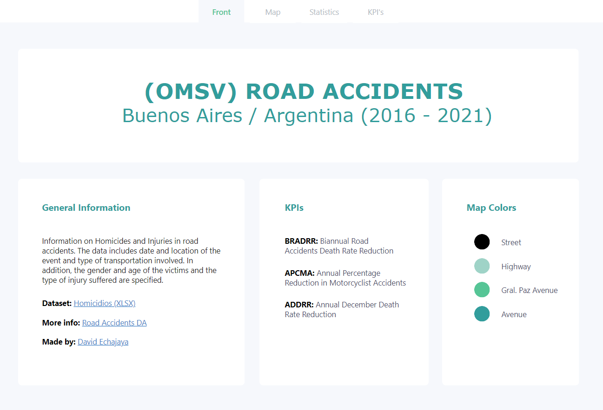

# Road-Accidents-DA

Data Analytics project for the (OMSV) studies center (Buenos Aires - Argentina).

This project seeks to carry out an exploratory analysis of the data provided by the traffic accident study center in Buenos Aires - Argentina. Additionally, an interactive dashboard is required to analyze data with more depth and to substract valuable insights and recommendations for the OMSV entity. This analysis could lead the decision making process for the Buenos Aires City Government.

Below is the Table of Content:

- [Road-Accidents-DA](#road-accidents-da)
  - [DashBoard](#dashboard)
  - [Technologies](#technologies)
  - [Project Files](#project-files)
  - [Data Analytics Techniques](#data-analytics-techniques)
  - [Datasets](#datasets)
    - [Descriptive Metadata](#descriptive-metadata)
      - [Quantitative Variables](#quantitative-variables)
      - [Qualitative Variables](#qualitative-variables)
    - [Null Values Management](#null-values-management)
  - [EDA Structuration](#eda-structuration)
  - [Ultimate Insights](#ultimate-insights)

## DashBoard

Please visit this [link](https://app.powerbi.com/view?r=eyJrIjoiMjdiNTgwNjEtMTQ3OC00ODY3LTgwNDEtNTUxNmM3Mjk2MDlhIiwidCI6ImFlNTI1NzU3LTg5YmEtNGQzMC1hMmY3LTQ5Nzk2ZWY4YzYwNCIsImMiOjR9) for an interactive view of the dashboard published on the web!

**IMPORTANT:** The GeoSpatial map used (ArcGis) for visualize latitude (Y) and longitude (X) coordinates and other meaningful data is not supported in PowerBI web published reports. Principal reason is I can't afford an ArcGis paid account at the moment. However, I will share in this readme some report images!

## Technologies

## Project Files

For information related to the files, types and descriptions that compose this project please refer to the following table:

| ID | Name          | Type   | Description                                                           |
|----|---------------|--------|-----------------------------------------------------------------------|
| 1  | data          | .xlsx | Contains raw data about road accidents provided by the OMSV|
| 2  | data/geodata | .shp | Contains a Buenos Aires shape file used for plotting road accidents      |
| 3  | data/metadata | .xlsx | Contains modified descriptive metadata with detailed information|
| 4  | .gitignore | .git | Contains ignored virtual environment and testing file|
| 5  | graphs | .png | Contains images of all graphs used in the EDA analysis|
| 6  | src | .png | Contains images used as source for this readme file and for the EDA notebook|
| 7  | EDA | .ipynb | Contains all the EDA process detailed with markdown comments and step by step|
| 8  | utils | .py | Custom Python functions used in this project|
| 9  | requirements | .txt | Libraries required for project operation |

## Data Analytics Techniques

Next there is a comprehensive list with the Data Analytics techniques used for this project:

* Exploratory Data Analysis (EDA)
* Univariate Analysis 
* Multivariate Analysis 
* Descriptive Statistics 
* Frequency Distribution Charts and tables 
* Cross Tabulation Matrixes
* Box Plots 
* Measures of Central Tendency and Dispersion

## Datasets

For this project a dataset with 2 related tables were used. The dataset is a XLSX file with the following Sheet structure:

* Homicidios.xlsx
  * Hechos
  * Victimas
  * Diccionario Hechos
  * Diccionario Victimas
  * Glosario

The 'Hechos' and 'Victimas' sheets contains the main information about 696 road accidents occurred from 2016 to 2021. The remaining sheets contain information about the descriptive metadata and a glossary of relevant words. In the following section the dataset descriptive metadata will be showed in detail.

More info: https://data.buenosaires.gob.ar/dataset/victimas-siniestros-viales

### Descriptive Metadata

Please query the following table for the dataset descriptive metadata:

| VARIABLE      | DESCRIPCION                                            | DTYPE            | CLASE         | CATEGORIA   |
|---------------|-------------------------------------------------------|------------------|---------------|-------------|
| ID            | Identificador unico del siniestro                    | [&lt;class 'str'&gt;] | Categorica | Nominal     |
| N_VICTIMAS    | Cantidad de víctimas                                  | [&lt;class 'int'&gt;] | Cuantitativa | Discreta    |
| FECHA         | Fecha en formato dd/mm/aaaa                            | [&lt;class 'str'&gt;] | Categorica | Ordinal     |
| AAAA          | Año                                                   | [&lt;class 'int'&gt;] | Cuantitativa | Discreta    |
| MM            | Mes                                                   | [&lt;class 'int'&gt;] | Cuantitativa | Discreta    |
| DD            | Día del mes                                           | [&lt;class 'int'&gt;] | Cuantitativa | Discreta    |
| HORA          | Hora del siniestro                                    | [&lt;class 'str'&gt;] | Categorica | Ordinal     |
| HH            | Franja horaria entera                                 | [&lt;class 'int'&gt;] | Cuantitativa | Discreta    |
| LUGAR         | Dirección del hecho                                   | [&lt;class 'str'&gt;] | Categorica | Nominal     |
| TIPO_CALLE    | Tipo de arteria. Para intersecciones se clasifica... | [&lt;class 'str'&gt;] | Categorica | Nominal     |
| CALLE         | Nombre de la arteria donde se produjo el hecho        | [&lt;class 'str'&gt;] | Categorica | Nominal     |
| ALTURA        | Altura de la arteria donde se produjo el hecho        | [&lt;class 'int'&gt;] | Cuantitativa | Discreta    |
| CRUCE         | Cruce en caso de que sea una encrucijada              | [&lt;class 'str'&gt;] | Categorica | Nominal     |
| DIRECCION     | Direccion en formato normalizado usig                | [&lt;class 'str'&gt;] | Categorica | Nominal     |
| COMUNA        | Comuna de la ciudad (1 a 15)                          | [&lt;class 'int'&gt;] | Categorica | Nominal     |
| XY_(CABA)     | Geocodificación plana                                 | [&lt;class 'str'&gt;] | Categorica | Nominal     |
| POS_X         | Longitud con separador punto. wgs84                  | [&lt;class 'str'&gt;] | Cuantitativa | Continua    |
| POS_Y         | Latitud con separador punto. wgs84                   | [&lt;class 'str'&gt;] | Cuantitativa | Continua    |
| PARTICIPANTES | Conjunción de víctima y acusado                      | [&lt;class 'str'&gt;] | Categorica | Nominal     |
| VICTIMA       | Vehículo del fallecido, o bien peatón/a.              | [&lt;class 'str'&gt;] | Categorica | Nominal     |
| ACUSADO       | Vehículo del acusado/a del hecho, sin implicar...    | [&lt;class 'str'&gt;] | Categorica | Nominal     |

#### Quantitative Variables

Please query the following table for the dataset Quantitative Variables:

| VARIABLE      | DESCRIPCION                                            | DTYPE            | CLASE         | CATEGORIA   |
|---------------|-------------------------------------------------------|------------------|---------------|-------------|
| N_VICTIMAS    | Cantidad de víctimas                                  | [&lt;class 'int'&gt;] | Cuantitativa | Discreta    |
| AAAA          | Año                                                   | [&lt;class 'int'&gt;] | Cuantitativa | Discreta    |
| MM            | Mes                                                   | [&lt;class 'int'&gt;] | Cuantitativa | Discreta    |
| DD            | Día del mes                                           | [&lt;class 'int'&gt;] | Cuantitativa | Discreta    |
| HH            | Franja horaria entera                                 | [&lt;class 'int'&gt;] | Cuantitativa | Discreta    |
| ALTURA        | Altura de la arteria donde se produjo el hecho        | [&lt;class 'int'&gt;] | Cuantitativa | Discreta    |
| POS_X         | Longitud con separador punto. wgs84                  | [&lt;class 'str'&gt;] | Cuantitativa | Continua    |
| POS_Y         | Latitud con separador punto. wgs84                   | [&lt;class 'str'&gt;] | Cuantitativa | Continua    |

#### Qualitative Variables

Please query the following table for the dataset Qualitative Variables:

| VARIABLE      | DESCRIPCION                                            | DTYPE            | CLASE         | CATEGORIA   |
|---------------|-------------------------------------------------------|------------------|---------------|-------------|
| ID            | Identificador unico del siniestro                    | [&lt;class 'str'&gt;] | Categorica | Nominal     |
| FECHA         | Fecha en formato dd/mm/aaaa                            | [&lt;class 'str'&gt;] | Categorica | Ordinal     |
| HORA          | Hora del siniestro                                    | [&lt;class 'str'&gt;] | Categorica | Ordinal     |
| LUGAR         | Dirección del hecho                                   | [&lt;class 'str'&gt;] | Categorica | Nominal     |
| TIPO_CALLE    | Tipo de arteria. Para intersecciones se clasif...     | [&lt;class 'str'&gt;] | Categorica | Nominal     |
| CALLE         | Nombre de la arteria donde se produjo el hecho        | [&lt;class 'str'&gt;] | Categorica | Nominal     |
| CRUCE         | Cruce en caso de que sea una encrucijada              | [&lt;class 'str'&gt;] | Categorica | Nominal     |
| DIRECCION     | Direccion en formato normalizado usig                | [&lt;class 'str'&gt;] | Categorica | Nominal     |
| COMUNA        | Comuna de la ciudad (1 a 15)                          | [&lt;class 'int'&gt;] | Categorica | Nominal     |
| XY_(CABA)     | Geocodificación plana                                 | [&lt;class 'str'&gt;] | Categorica | Nominal     |
| PARTICIPANTES | Conjunción de víctima y acusado                      | [&lt;class 'str'&gt;] | Categorica | Nominal     |
| VICTIMA       | Vehículo del fallecido, o bien peatón/a.              | [&lt;class 'str'&gt;] | Categorica | Nominal     |
| ACUSADO       | Vehículo del acusado/a del hecho, sin implicar...    | [&lt;class 'str'&gt;] | Categorica | Nominal     |

### Null Values Management

The Dataset tagged every null value by default with the 'SD' tag, which means 'Sin Dato'. Nevertheless, some columns had still empty values that needed to be managed. In the following table null values state for each dataset column are showed prior to the null values treatment:

| Column        | No_Null_% | No_Null_Qty | Null_% | Null_Qty |
|---------------|-----------|-------------|--------|----------|
| ID            | 100.00    | 696         | 0.00   | 0        |
| N_VICTIMAS    | 100.00    | 696         | 0.00   | 0        |
| FECHA         | 100.00    | 696         | 0.00   | 0        |
| AAAA          | 100.00    | 696         | 0.00   | 0        |
| MM            | 100.00    | 696         | 0.00   | 0        |
| DD            | 100.00    | 696         | 0.00   | 0        |
| HORA          | 100.00    | 696         | 0.00   | 0        |
| HH            | 100.00    | 696         | 0.00   | 0        |
| LUGAR         | 100.00    | 696         | 0.00   | 0        |
| TIPO_CALLE    | 100.00    | 696         | 0.00   | 0        |
| CALLE         | 99.86     | 695         | 0.14   | 1        |
| ALTURA        | 18.53     | 129         | 81.47  | 567      |
| CRUCE         | 75.43     | 525         | 24.57  | 171      |
| DIRECCION     | 98.85     | 688         | 1.15   | 8        |
| COMUNA        | 100.00    | 696         | 0.00   | 0        |
| XY_(CABA)     | 100.00    | 696         | 0.00   | 0        |
| POS_X         | 100.00    | 696         | 0.00   | 0        |
| POS_Y         | 100.00    | 696         | 0.00   | 0        |
| PARTICIPANTES | 100.00    | 696         | 0.00   | 0        |
| VICTIMA       | 100.00    | 696         | 0.00   | 0        |
| ACUSADO       | 100.00    | 696         | 0.00   | 0        |

For the EDA process, Null values were imputed with the 'SD' tag. However, considering the small quantity of null values in **CALLE** and **DIRECCION** columns, this records will be removed for the dashboard construction.

Due to the high amount of null values in the **ALTURA** column, this column will be removed for the dashboard construction.

The **CRUCE** column was imputed with the 'SD' tag.

## EDA Structuration

 
 

The EDA is structured as follows:

* Data Dictionary
* Quantitative Variables
  * VAR 1
    * Descriptive Statistics
    * Suitable Graph
    * Box-Plot
  * VAR 2
    * Descriptive Statistics
    * Suitable Graph
    * Box-Plot
  * VAR 3
    * Descriptive Statistics
    * Suitable Graph
    * Box-Plot
  * etc...
* Qualitative Variables
  * VAR 1
    * Graph
    * Frequency Table
  * VAR 2
    * Graph
    * Frequency Table
  * VAR 3
    * Graph
    * Frequency Table
  * etc...
* Insights
  * Cross Tabulation Heat Map

Some graphs can vary depending on the data analyzed, as we can see in the cover of this section. The graph is plotting all the road accidents in Buenos Aires by their respective longitude and latitude coordenates. Also the design pattern and styles among all graphs is maintained for a clearer data lecture and analysis.

## Ultimate Insights

* December was identified as the most deadly month with 76 accidents registered from 2016 to 2021. The avarage number of accidents per month is 57, which indicates that December is 33.33% above the avarage quantity.
* Avenues were identified as the most deadly road type above Streets and Highways. 62.87% of the victims died in Avenues road accidents. Cars are the main causes, pedestrians and motorcycles are the main victims.
* The number of accidents dropped significantly from 2018 to 2020 (142 to 76 accidents respectively), being the COVID-19 the main cause.
* Motorcyclists are the main victims in Highways road accidents, representing a 61% of the total victims in Highways.
* In Buenos Aires, 1.35 citizens per 100,000 inhabitants suffer a deadly road accident.
* Only 23.15% of victims were women
* 108 accidents were caused by passengers affecting pedestrians (15.81%). The main cause is attributed to the context of crime in the city of Buenos Aires, where the most common types of robbery and hitman include a motorcyclist and a companion.